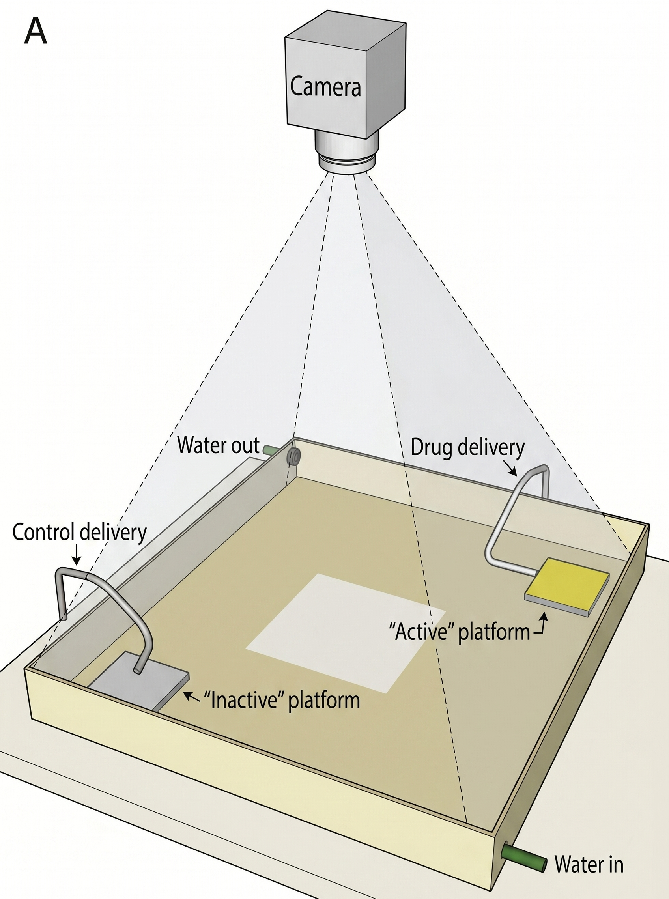
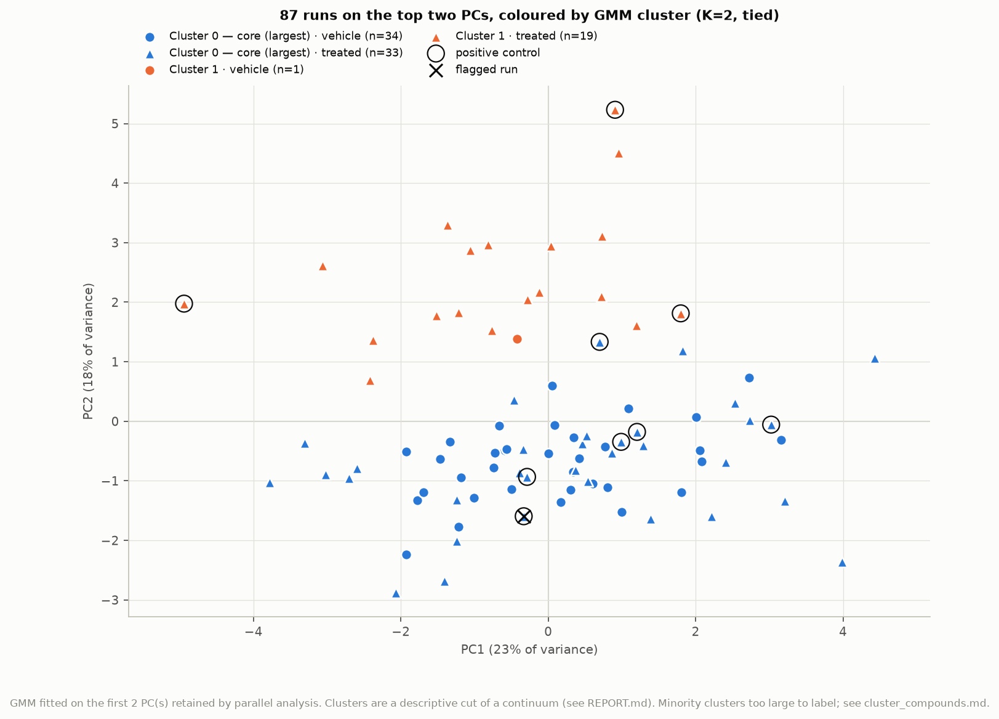

# zf_opioid : run-level PCA → GMM for the zebrafish opioid self-administration assay

Point this at a folder of self-administration runs and it produces, for every run, 14 behavioural
features and a Gaussian-mixture analysis of them:
- **3 trigger rates** from the event logs;
- **5 timing features**, describing when and in what order platform visits happen;
- **6 pose features** from a YOLOv11-pose model.

The analysis asks whether the runs fall into discrete behavioural groups, and which compounds
land where.

The trained pose model is included (`models/best.pt`), so nothing needs training. You supply the
run folders and a metadata file saying what each run was.

## The assay

This pipeline is built for the zebrafish opioid self-administration assay of
[Bossé & Peterson (2017)](https://doi.org/10.1016/j.bbr.2017.08.001):
- A shallow tank has two raised platforms in opposite corners.
- A fish over the yellow (active) platform triggers a dose of hydrocodone. The white (inactive)
  platform delivers saline.
- An overhead camera detects the triggers and saves a photo of every active one.
- Each run is 5 fish for 50 minutes.



**The pipeline assumes this set-up.** Calibration, the platform layout and the pose model are all
specific to it; see [Assumptions and limits](#assumptions-and-limits).

## Setup

Python 3.13. From this folder:

```
python -m venv .venv
.venv\Scripts\pip install -r requirements.txt        (Windows)
.venv/bin/pip install -r requirements.txt            (macOS / Linux)
```

Check the install with `python tests.py`. It needs no data and takes about a minute.

## 1. Lay out the data

Put every run in one folder, one subfolder per run. Each subfolder name starts with the run's start
time, `YYYYMMDD_HHMMSS`; that timestamp is the run's id. Each run folder holds exactly what the rig
writes:

```
my_runs/
  20260303_155417_self_admin_g1_DMSO/
    active_events.tsv       frame_idx, t_seconds, signal, baseline — one row per active trigger
    inactive_events.tsv     same, inactive platform
    params.json             rig settings, including active_roi and inactive_roi
    images/                 active_trigger_NNNN_frame_NNNNNN_YYYYMMDD_HHMMSS.jpg, one per active trigger
  20260303_165830_self_admin_g1_MK801_20uM/
    ...
```

Include only runs you want analysed. Habituation, training and test runs do not belong here.

## 2. Write `metadata.csv`

The pipeline takes compound, dose, fish group and so on from `metadata.csv`, **not** from folder
names. Draft it from the folder names, then check it:

```
python make_metadata.py --runs D:/my_runs
```

This writes `D:/my_runs/metadata.csv` and lists anything it could not read. Open the file and check
every row, especially compound spellings (runs of the same compound and dose must share one label),
`fish_group`, and failures.

| column | meaning |
|---|---|
| `run_id` | `YYYYMMDD_HHMMSS`, the start of the folder name. **Required.** One row per run folder. |
| `folder` | folder name. For your reference only. |
| `date` | experiment day, `YYYY-MM-DD`. If left blank, taken from `run_id`. |
| `fish_group` | fish group (`1`, `2`, `2.5`, …). If left blank, it is filled from same-day runs when they agree, otherwise set to its own `unknown_<date>` group. A half group such as `2.5` is its own group. |
| `compound` | compound label. Runs with the same compound and dose are replicates. |
| `dose_value`, `dose_unit` | e.g. `20`, `uM`. Leave blank for vehicle runs. |
| `is_vehicle` | `true` for DMSO vehicle controls. **Required.** At least 3 are needed, and days with 2+ vehicle runs are needed for day-centring. |
| `is_positive_control` | `true` for positive controls. They are circled on the figures. |
| `exclude` | `true` drops the run completely, e.g. a fish died or a tube came off. |
| `exclusion_reason` | why. For the record. |
| `flag` | free text, e.g. `bugged pump`. The run is **kept**, marked on figures, and a sensitivity refit without flagged runs is reported. |
| `run_order_within_day` | 1, 2, 3 … If left blank, ranked from the start times of the runs listed. |
| `notes` | anything. Ignored. |

Booleans accept `true/false`, `yes/no` or `1/0`; blank means false. Compound spellings in folder
names are mapped to labels by `metadata.compound_aliases` in `params.yaml`. Add your compounds
there if you want the draft to spell them consistently.

## 3. Run

```
python run_pipeline.py --runs D:/my_runs --out D:/my_results
```

`--metadata` defaults to `metadata.csv` inside `--runs`. The pipeline runs six stages and prints
progress and any warnings:

| stage | what it does | output in `--out` |
|---|---|---|
| check | matches `metadata.csv` to the folders and checks that each run has its files and that the JPEGs match the trigger log | — |
| events | reads the trigger logs, drops the first 10 s (detector start-up), and fits the per-trigger blind time | `runs`, `events` |
| calibration | finds the yellow platform and two tank fittings in each run and maps the image into a common tank frame | `calibration` |
| pose | YOLO pose model on every trigger JPEG: up to 5 fish, with head/centre/tail and which fish triggered | `pose_detections`, `pose_frame_qc` |
| features | bouts (triggers < 5 s apart = one visit), observed time, equal-effort bout draws, and the 14 features and QC covariates | `bouts`, `exposure`, `effort_index`, `effort_status`, `features_tier_a`, `features_timing`, `features_tier_c` |
| analysis | PCA → GMM with null, bootstrap and robustness checks; figures; report | `pca_gmm/` |

Pose inference is the slow step, roughly 1 minute per 1,000 JPEGs on a CPU. Calibration and pose
results are cached per run in `--out/cache/`. When you add runs later, re-run the same command:
only the new runs are processed. Everything downstream is recomputed, because the analysis
depends on the whole set.

Useful options:
- `--stop-after check` validates the metadata and folders only.
- `--force pose` redoes inference. It is rarely needed: changing the model file, the inference settings, the image count or the calibration already invalidates a run's cached pose results.
- `--params other.yaml` uses a different settings file.

## 4. Read the results

Start with **`pca_gmm/REPORT.md`** and **`pca_gmm/figures/08_clusters_PC1_PC2.png`**.
`pca_gmm/cluster_compounds.md` lists which compounds are in which cluster, and
`pca_gmm/gmm_assignments.csv` gives every run's cluster.



*Example output from the 94-run development set (87 runs scored). The two clusters are a
descriptive cut of a continuum, not discrete behavioural states.*

The analysis treats **"no clusters" (K = 1) as a real answer**, and several checks guard against
finding structure that is not there:
- **ΔBIC and p_null.** BIC must beat a single Gaussian by at least 2. p_null is how often data
  drawn from *one* Gaussian produce as large a ΔBIC under the identical procedure. When K = 1
  wins, the report still shows the best 2-way split, labelled *descriptive only*.
- **Bootstrap ARI.** Whether the same split reappears when the runs are resampled; 1 means
  identical.
- **Robustness.** Whether the split survives different feature scaling and PCA fitted on vehicle
  runs only.
- **Degenerate clusters.** A cluster of one or two runs whose covariance collapsed. These are
  outliers, not groups.
- **Confounds.** Within-date permutation tests of each cluster against day, fish group, detection
  quality, and when in the session the pose frames came from. A cluster that tracks these is not
  a phenotype.

## The 14 features

| block | feature | meaning |
|---|---|---|
| trigger | `active_bout_rate_per_obs_min` | active-platform visits per observable minute (10–2900 s) |
| trigger | `inactive_bout_rate_per_obs_min` | inactive-platform visits per observable minute |
| trigger | `mean_triggers_per_bout` | doses per active visit |
| timing | `pref_change` | change in active-vs-inactive preference from early (0–20 min) to late (30–48 min) |
| timing | `switch_excess` | active visits followed by an inactive visit, relative to chance (log ratio) |
| timing | `bin_slope` | within-run decline of the active visit rate, per 10 min |
| timing | `first_active_latency_log` | log seconds to the first active trigger |
| timing | `first_inactive_latency_log` | log seconds to the first inactive trigger. Set to the window end if there was none. |
| pose | `trig_radial_offset` | how far from the platform centre the triggering fish sits |
| pose | `trig_heading_outward` | whether the triggering fish is heading off (+1) or onto (−1) the platform |
| pose | `nontrig_pref_index` | whether the other four fish are nearer the active or the inactive platform |
| pose | `mean_nn_distance` | shoal cohesion: mean nearest-neighbour distance |
| pose | `polarization_nontrigger` | how aligned the other fish's headings are |
| pose | `frac_in_rim` | share of the other fish along the tank wall (thigmotaxis) |

Pose features are averaged within each visit first. Each run is then summarised over 200 random
draws of 20 visits, so busy and quiet runs are measured with the same effort. Runs with fewer than
20 active visits in the window have no pose features and are not scored.

## Settings

`params.yaml` holds every setting and is optional; the same values are built into
`zfsa/config.py`. The `metadata` section only affects the metadata draft. `inference.device` may be
set to a GPU (`cuda:0`). Anything else changes the analysis, so keep the defaults if your results
should be comparable to other lab members'.

## Assumptions and limits

- **Same rig and camera.** Calibration uses pixel constants measured on this rig: the burned-in
  text box, the yellow platform's colour and size, and where the two fittings sit. A different
  tank or camera position needs them re-measured in `zfsa/geometry.py`.
  - If the pipeline warns that the platform was not found, a run is often still usable (it falls
    back to the hand-drawn ROI).
  - If it warns that the active ROI does not look yellow, check whether active and inactive were
    swapped.
- **Five fish per run.** `best.pt` was trained on this rig's images.
- **The run is the unit.** The five fish shoal, so they are not independent.
- **Sample size.** With fewer than 84 scored runs (6 per feature) the report warns that the
  analysis is fragile. With fewer than 20 it stops.
- **Pose features are conditioned on triggering.** JPEGs exist only when a fish triggers, so pose
  features say nothing about behaviour away from the platform. A compound that sedates fish
  lowers trigger rates without reducing drug-seeking. A food self-administration control is the
  specificity check.
- Everything here is exploratory. It is not a statistical test for hits.

## Citation

If you use this pipeline, please cite the assay it was built for:

> Bossé GD, Peterson RT (2017). Development of an opioid self-administration assay to study drug
> seeking in zebrafish. *Behavioural Brain Research* 335:158–166.
> [doi:10.1016/j.bbr.2017.08.001](https://doi.org/10.1016/j.bbr.2017.08.001)

The same reference is in `CITATION.cff`, which GitHub shows as "Cite this repository".

## Layout

```
run_pipeline.py      the pipeline
make_metadata.py     drafts metadata.csv
params.yaml          settings (optional)
models/best.pt       YOLOv11-pose weights: 3 keypoints (head, centre, tail)
tests.py             unit tests
CITATION.cff         how to cite
docs/figures/        README figures
zfsa/                the code, one module per step:
  paths, config, naming, metadata, events, geometry, infer, bouts,
  features, pose_features, normalize, gmm, analysis
```
